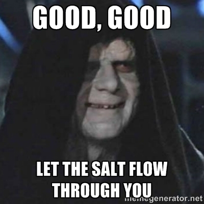

# sliki

# h1
## h2
### h3
#### h4
##### h5

This is slick wiki, the Storage-Linked wIKI.

**item_27900.name**

Level **item_27900.level** **item_27900.item_type**

Found in **item_27900.area**

**item_27900.description**

**item_27900.affected[0].location**

.

.

.

.

.

.

.

.

.

.

This one doesn't work: **npc["__class__/handler_npc.Npc"].description**

[derp](derp)